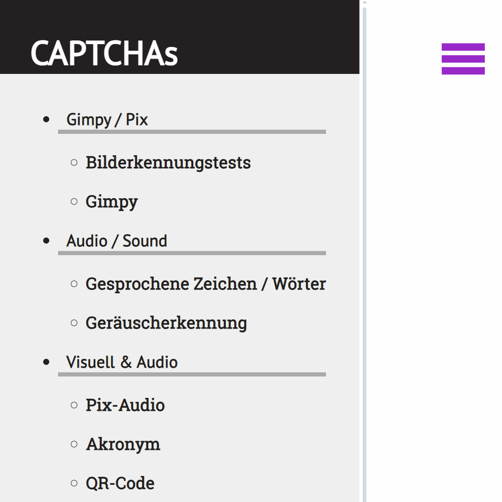
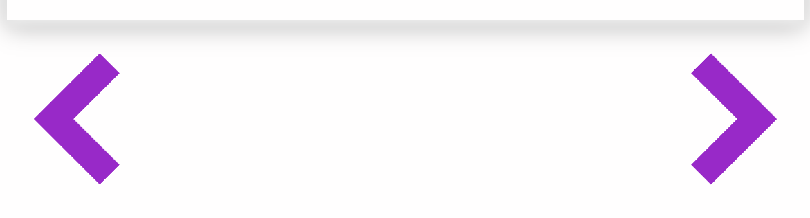
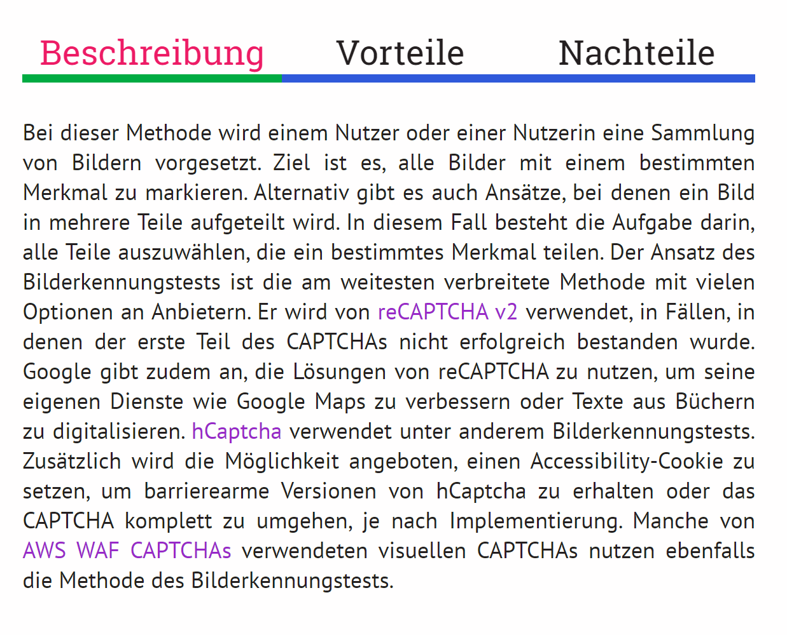

# Effektive CAPTCHAs für Sehbehinderte : Eine Sammlung für Entwickler\*innen
Praxisprojekt SS 24 im Studiengang Medieninformatik an der TH Köln Campus Gummersbach.

Das Projekt wird von [Prof. Christian Noss](https://www.th-koeln.de/personen/christian.noss/) betreut.

Die Sammlung finden sie <b>-> [hier](https://niklasmehlem.github.io/captchaCollection/) <-</b>

In diesem Projekt wird eine nutzbare CAPTCHA-Sammlung erstellt, die Entwicklern einen besseren Überblick über die vorhandenen CAPTCHA-Alternativen mit Fokus auf Nutzerfreundlichkeit für Sehbehinderte geben soll. Durch die interaktive Sammlung sollen die verschiedenen Ansätze besser vermittelt werden, als es im einfachen Text- und Bildformat möglich wäre. So können Entwickler durch das eigene Erlebnis und die bereitgestellten Informationen fundierte Entscheidungen über den Einsatz einer CAPTCHA-Methode treffen.
Ziel der Arbeit ist es nicht, eigene CAPTCHAs zu konzipieren oder zu entwickeln. Dennoch kommen neu konzipierte CAPTCHAs aus anderen Arbeiten in der Sammlung vor. Diese haben sich bereits mit dem Thema auseinandergesetzt und werden ebenfalls aufgeführt, um als Inspiration oder Ansatz zu dienen.

CAPTCHAs und andere Formen der Bot-Abwehr sind in der heutigen Zeit des Internets für Betreiber von Webseiten und Webdiensten unerlässlich geworden. Im Jahr 2022 betrug der Anteil von Bots 47,4% am gesamten Netzverkehr, was einem Anstieg von beinahe 5% im Vergleich zum Vorjahr entsprach. Im Jahr 2023 stieg der Anteil von Bots im Netzverkehr weiter auf 49,6%. Es ist hierbei unerheblich, ob es sich um wohlwollende oder böswillige Bots handelt, Ressourcen werden gleichermaßen beansprucht. Dies kann das Nutzererlebnis verschlechtern, da alle Ressourcen bereits von den Bots aufgebraucht werden, und im schlimmsten Fall so ganze Webseiten lahmlegen. Es gibt viele verschiedene Methoden der Bot-Abwehr. CAPTCHAs gehören dabei zu den einfacheren Lösungsansätzen und können bei verschiedenen Anbietern erworben werden, um die eigene Webseite zu schützen. Auch wenn im Laufe der Zeit erkannt wurde, dass die oft visuellen CAPTCHAs nicht für alle Nutzer\*innen geeignet sind, waren die bisherigen Lösungsansätze zur Entwicklung von CAPTCHAs für Menschen mit Sehbehinderung in den meisten Fällen unzureichend. Bevor über einen neuen Ansatz für CAPTCHAs nachgedacht werden kann, ist es wichtig, die bestehenden CAPTCHA-Methoden zu analysieren. Gibt es einen Bedarf für einen neuen Ansatz, oder sind bereits etablierte Methoden vorhanden, die effektiv funktionieren? Existieren Methoden, die derzeit nicht effektiv sind, jedoch mit geringem Aufwand angepasst werden könnten, um für Nutzer\*innen mit Sehbehinderung zugänglich zu sein? Da CAPTCHAs einen erheblichen Beitrag zum Nutzererlebnis leisten, wurde beschlossen, eine Sammlung im Format einer Webseite zu entwickeln. Auf dieser Webseite können Entwickler die gesammelten CAPTCHAs selbst erleben, um fundierte Entscheidungen über die Implementierung der verschiedenen Methoden zu treffen. In der Sammlung wurden sowohl konventionelle CAPTCHAs von Anbietern aufgenommen als auch Ansätze aus wissenschaftlichen Arbeiten, die speziell für Nutzer\*innen mit Sehbehinderung entwickelt wurden.

Hier finden Sie das Abschlussvideo zur Arbeit, in dem das Projekt im Videoformat vorgestellt wird: [Abschlussvideo](https://youtu.be/2b8xVzGMyow)

# Bedienungshinweise

Über das Seitenmenü kann jederzeit zu jeder beliebigen CAPTCHA-Methode navigiert werden. Mit dem Klicken auf das 'Hamburger-Menü-Symbol' kann das Seitenmenü geschlossen und wieder geöffnet werden.
 

Mithilfe der beiden Pfeilknöpfe kann jeweils zur vorhergehenden Methode oder zur nächsten Methode in der CAPTCHA-Sammlung gewechselt werden.
 

Über die Tabs 'Beschreibung', 'Vorteile' und 'Nachteile' können die verschiedenen Beschreibungen und Bewertungen der CAPTCHA-Methoden eingesehen werden. Die lila hervorgehobenen Namen sind Links zu den verschiedenen Anbietern der jeweiligen CAPTCHA-Ansätze.  Nicht alle Methoden werden heutzutage noch angeboten, weshalb bei nicht jedem Ansatz Anbieter verlinkt sind.
 

# Lizenzen
Alle Bild-, Audio- und Videodateien, die im Projekt verwendet wurden, wurden entweder selbst erstellt oder sind frei verfügbare Inhalte.
Die Webseiten, von denen diese Inhalte bezogen wurden, sind [Pixabay](https://pixabay.com/de/service/license-summary/) und [Luvvoice](https://luvvoice.com/terms-of-service).

Im Ordner <b>projekt-artefakte</b> finden sie des Weiteren die dazugehörige schriftliche Arbeit mit ausführlichem Quellenverzeichnis.

# Kontakt
niklas.mehlem@smail.th-koeln.de
oder
niklas.mehlem@gmail.com
